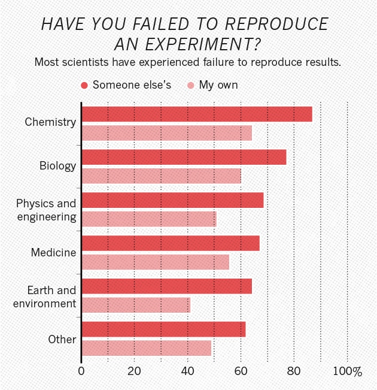
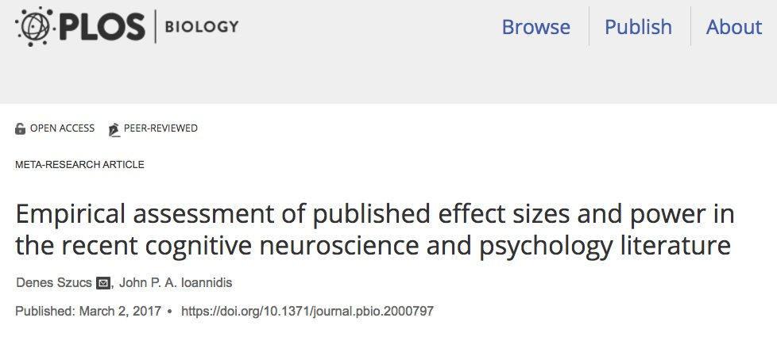
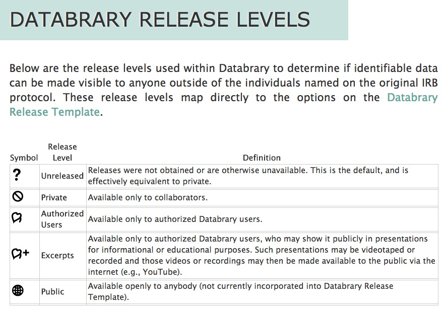

```{r setup, include=FALSE}
knitr::opts_chunk$set(echo = FALSE)
```

## Acknowledgments


<div class="notes">
Thank you to the National Science Foundation and the National Institute of Child Health and Human Development for their support of my work.
</div>

## Why this discussion & why now?

## Is there a reproducibility crisis?

- Yes, a significant crisis.
- Yes, a slight crisis.
- No, there is no crisis.
- Don't know.

<div class="notes">
Could I see a show of hands from those who say there is a significant reproducibility crisis? A 'slight' crisis? No crisis? Don't know.
</div>

---

<div class="centered">
<a href="http://www.nature.com/polopoly_fs/7.36716.1469695923!/image/reproducibility-graphic-online1.jpeg_gen/derivatives/landscape_630/reproducibility-graphic-online1.jpeg" height=450px>

</a>

[Baker 2016](http://doi.org/10.1038/533452a)
</div>

<div class="notes">
Here are the results from a survey published last year in Nature.
</div>

---

<div class="centered">
<a href="http://www.nature.com/polopoly_fs/7.36718.1464174471!/image/reproducibility-graphic-online3.jpg_gen/derivatives/landscape_630/reproducibility-graphic-online3.jpg">

</a>

[Baker 2016](http://doi.org/10.1038/533452a)
</div>

<div class="notes">
The same survey asked about the prevalence of reproduciblility problems across fields.
</div>

---

<div class="centered">
<a href="http://www.nature.com/polopoly_fs/7.36719.1464174488!/image/reproducibility-graphic-online4.jpg_gen/derivatives/landscape_630/reproducibility-graphic-online4.jpg">

</a>

[Baker 2016](http://doi.org/10.1038/533452a)
</div>

<div class="notes">
Here are the data from the Nature survey.
</div>

---

<div class="centered">
<a href="https://doi.org/10.1371/journal.pbio.2000797">

</a>

> *"false report probability is likely to exceed 50% for the whole literature"*
</div>

---

<div class="centered">

</div>

<div class="notes">
How many of you have physics envy?
</div>

---

<div class="centered">


[Ferguson 2015](http://doi.org/10.1037/a0039405)
</div>

## Behavioral science is harder than physics

<div class="notes">
Well, you don't because behavioral science is harder than physics.
</div>

---

<div class="centered">

</div>

<div class="notes">
Physicists are rightly proud that they can predict precisely what will happen if we put a mass on an inclined plane in a gravitational field.
</div>

---

<div class="centered">

</div>

<div class="notes">
But if we change the mass to a mouse, what happens?
Our predictions go out the window. Why?
Because there are too many variables...
Behavioral science is orders of magnitude harder than physics.
</div>

## What's the more important and lasting contribution?

---

### Our (possibly wrong) findings?

### Our (well-curated) data?

---

<div class="centered">

</div>

<div class="notes">
If we think about every finding or data point as a brick, then we don't want unorganized piles
</div>

---

<div class="centered">

</div>

<div class="notes">
We want orderly, strong, structures of knowledge. That means we need to have standardization and order for each of the bricks and mortar that binds them together.
</div>

---

### Journals +
### Repositories = 
### Structures of knowledge

## Journals

- Public face(s)
- Peer review
- Thematic foci
- Consistent formatting, standards

## Repositories

- ~~Lab, departmental, institutional web sites.~~
- ~~Dropbox, Box, Google, etc.~~
- **Domain specific**, like journals
- Long-term preservation, persistent identifiers
- Foundation of future platforms for discovery
    
## Who owns your data?

>- ~~you~~
>- your institution
>- your sponsors (or the taxpayers)
>- your participants
>- responsible data stewardship

---

<div class="centered">

</div>
    
<!-- ## Databrary -->

<!-- - Founded in early 2014 -->
<!-- - Funded by NSF & NICHD -->
<!-- - Specializes in storing, managing, sharing **video** -->
<!-- - Policy framework for *restricted* sharing of identifiable research data with *participant permission* -->
<!--     - Institutional agreement (data use & contribution) -->
<!--     - Sharing permission templates -->

## Lessons learned

---

### Identifiable data **can** be shared 
### & most participants agree to sharing

---

<video width="720" height="450" controls>
  <source src="https://www.databrary.org/video/example-video-1.mp4" type="video/mp4">
Your browser does not support the video tag.
</video>

https://www.databrary.org/video/example-video-1.mp4

## Ethical sharing

- Restrict access to researchers
    - Institutional (data use & contribution) [agreements](https://www.databrary.org/access/policies/agreement.html)
- Sharing only with permission
    - Permission [templates](https://www.databrary.org/access/policies/release-template.html), scripts, videos
- Consistent levels of access

---

<div class="centered">
<a href="https://www.databrary.org/access/guide/investigators/release/release-levels.html">

</a>
</div>
    
---

### Consistent data management **during data collection** (active curation) makes sharing easy(er) afterward.

---

### Capturing metadata about people, settings, measures makes data sets searchable, filterable, & more easily reused.

---

<div class="centered">

</div>

---

<video width="720" height="450" controls>
  <source src="mov/databrary-vol-8-incl-enr-rpt-high.mp4" type="video/mp4">
Your browser does not support the video tag.
</video>

## Video as data & documentation

---

<div class="centered">
<a href="http://doi.org/10.1038/s41562-017-0128">

</a>

[Gilmore & Adolph 2017](http://doi.org/10.1038/s41562-017-0128)
</div>

---

<div class="centered">


<https://dev1.ed-projects.nyu.edu/wikis/docuwiki/doku.php/landing>
</div>

<!-- --- -->

<!-- <div class="centered"> -->
<!--  -->
<!-- </div> -->

<!-- --- -->

<!-- <div class="centered"> -->
<!-- <a href="http://jupyter.org"> -->
<!--  -->
<!-- </a> -->
<!-- </div> -->

<!-- --- -->

<!-- <div class="centered"> -->
<!-- <a href="http://osf.io"> -->
<!--  -->
<!-- </a> -->
<!-- </div> -->

---

<div class="centered">

</div>

<div class="notes">
So, what other barriers we must overcome?
</div>

---

<div class="centered">

</div>

<div class="notes">
As a result our work, results, and methods are siloed.
</div>

---

<div class="centered">

</div>

<div class="notes">
And it often seems like we are the proverbial blind men examining the elephant.
</div>

---

<div class="centered">

</div>

## Transparency is good 

## Accelerating discovery is better

## My 'field of dreams'...

- Link data across studies, measures
- Link across group characteristics, individuals
- Enable searching & filtering by individual characteristics, tasks
- Support web-based data analysis, visualization; open API
- Implement a consistent framework for ethical data sharing
- Enable data aggregation, cloning, provenance tracking
- Support self/active curation
- Link to publications

## What's yours?

---

<div class="centered">


[gilmore-lab.github.io/aera-workshop-2017-07-26/](http://gilmore-lab.github.io/aera-workshop-2017-07-26/)
</div>


## Stack

This talk was produced on `r Sys.time()` in [RStudio 1.0.143](http://rstudio.com) using R Markdown and the reveal.JS framework.
The code and materials used to generate the slides may be found at <https://github.com/gilmore-lab/aera-workshop-2017-07-26/>. 
Information about the R Session that produced the code is as follows:

---

```{r session-info}
sessionInfo()
```

